# Getting Started

Welcome to your new project.

It contains these folders and files, following our recommended project layout:

File or Folder | Purpose
---------|----------
`app/` | content for UI frontends goes here
`db/` | your domain models and data go here
`srv/` | your service models and code go here
`package.json` | project metadata and configuration
`readme.md` | this getting started guide

## Next Steps

- Open a new terminal and run `cds watch`
- (in VS Code simply choose _**Terminal** > Run Task > cds watch_)
- Start adding content, for example, a [db/schema.cds](db/schema.cds).

## Learn More

Learn more at https://cap.cloud.sap/docs/get-started/.

# Modelagem do Projeto BTP Team Insight Platform

## Visão Geral

Este documento descreve a modelagem de dados e serviços do projeto **BTP Team Insight Platform**, baseado nos arquivos CDS (Core Data Services) e definições de serviço. O projeto utiliza SAP CAP (Cloud Application Programming Model) e está estruturado em dois namespaces principais:

- `my.company`: Schema principal para gestão de usuários, equipes, projetos e tarefas.
- `teamculture`: Schema para feedback, avaliações e cultura de equipe.

### Serviços Definidos

#### MainService
Serviço principal que expõe entidades para gestão de tarefas, usuários, equipes, projetos e habilidades.

#### Feedbacks
Serviço dedicado ao sistema de feedback e avaliações de equipe.

## Schema Principal (my.company)

### Entidades

#### Users
Representa os usuários do sistema.
- **Campos**: ID (UUID), name, email, documentId, birthDate, gender, phone, isActive, createdAt, updatedAt
- **Associações**: role (Roles), seniority (Seniorities), manager (Users)

#### Roles
Define os papéis dos usuários.
- **Campos**: ID (UUID), name, description

#### Seniorities
Níveis de senioridade.
- **Campos**: ID (UUID), name, level (Integer)

#### Teams
Equipes do projeto.
- **Campos**: ID (UUID), name, description, createdAt
- **Associações**: leader (Users)

#### TeamMembers
Membros das equipes.
- **Campos**: ID (UUID), joinedAt, leftAt
- **Associações**: user (Users), team (Teams)

#### Projects
Projetos.
- **Campos**: ID (UUID), name, description, status, startDate, endDate, createdAt
- **Associações**: owner (Users), team (Teams)

#### Allocations
Alocações de usuários em projetos.
- **Campos**: ID (UUID), roleInProject, startDate, endDate
- **Associações**: user (Users), project (Projects)

#### Skills
Habilidades disponíveis.
- **Campos**: ID (UUID), name, category

#### UserSkills
Habilidades dos usuários.
- **Campos**: ID (UUID), proficiency (Integer), lastUpdated
- **Associações**: user (Users), skill (Skills)

#### Tasks
Tarefas (não detalhada no arquivo lido, mas referenciada no serviço).

#### TaskStatuses, TaskComments, TaskTags, etc.
Entidades relacionadas a tarefas (não detalhadas no arquivo lido).

## Schema de Feedback (teamculture)

### Entidades

#### Employees
Funcionários para o sistema de feedback.
- **Campos**: name, email, role, hireDate, active
- **Associações**: team (Teams), skillsEmployee (EmployeeSkills)

#### SkillsFeedback
Habilidades no contexto de feedback.
- **Campos**: name, description
- **Associações**: employees (EmployeeSkills)

#### EmployeeSkills
Relação N:N entre Employees e SkillsFeedback.
- **Campos**: level (Integer), acquiredAt
- **Associações**: employee (Employees), skill (SkillsFeedback)

#### Teams
Equipes no contexto de feedback.
- **Campos**: name, area
- **Associações**: leader (Employees), members (Employees), surveys (Surveys)

#### Surveys
Pesquisas/avaliações.
- **Campos**: title, description, startDate, endDate
- **Associações**: team (Teams), questions (Questions), responses (Responses)

#### Questions
Perguntas das pesquisas.
- **Campos**: text, type (QuestionType)
- **Associações**: survey (Surveys), options (QuestionOptions)

#### QuestionOptions
Opções para perguntas.
- **Campos**: label, value (Integer)
- **Associações**: question (Questions)

#### Responses
Respostas das pesquisas.
- **Campos**: answerText, answerValue (Integer), createdAt
- **Associações**: survey (Surveys), question (Questions), employee (Employees)

#### Feedbacks
Feedbacks diretos.
- **Campos**: sender, content, type (FeedbackType), createdAt
- **Associações**: employee (Employees)

### Tipos Enumerados

#### FeedbackType
- Positive
- Constructive
- Anonymous

#### QuestionType
- Rating
- Boolean
- Text

## Diagrama de Relacionamentos

```mermaid
erDiagram
    USERS {
        UUID ID PK
        String name
        String email
        String documentId
        Date birthDate
        String gender
        String phone
        Boolean isActive
        Timestamp createdAt
        Timestamp updatedAt
    }
    ROLES {
        UUID ID PK
        String name
        String description
    }
    SENIORITIES {
        UUID ID PK
        String name
        Integer level
    }
    TEAMS {
        UUID ID PK
        String name
        String description
        Timestamp createdAt
    }
    TEAMMEMBERS {
        UUID ID PK
        Date joinedAt
        Date leftAt
    }
    PROJECTS {
        UUID ID PK
        String name
        String description
        String status
        Date startDate
        Date endDate
        Timestamp createdAt
    }
    ALLOCATIONS {
        UUID ID PK
        String roleInProject
        Date startDate
        Date endDate
    }
    SKILLS {
        UUID ID PK
        String name
        String category
    }
    USERSKILLS {
        UUID ID PK
        Integer proficiency
        Date lastUpdated
    }
    EMPLOYEES {
        UUID ID PK
        String name
        String email
        String role
        Date hireDate
        Boolean active
    }
    SKILLSFEEDBACK {
        UUID ID PK
        String name
        String description
    }
    EMPLOYEESKILLS {
        UUID ID PK
        Integer level
        Date acquiredAt
    }
    SURVEYS {
        UUID ID PK
        String title
        String description
        Date startDate
        Date endDate
    }
    QUESTIONS {
        UUID ID PK
        String text
        String type
    }
    QUESTIONOPTIONS {
        UUID ID PK
        String label
        Integer value
    }
    RESPONSES {
        UUID ID PK
        String answerText
        Integer answerValue
        Timestamp createdAt
    }
    FEEDBACKS {
        UUID ID PK
        String sender
        String content
        String type
        Timestamp createdAt
    }

```

## Considerações Finais

- O schema principal (`my.company`) foca na gestão operacional de usuários, equipes e projetos.
- O schema de feedback (`teamculture`) complementa com funcionalidades de avaliação e cultura organizacional.
- As associações definem relacionamentos claros entre entidades, facilitando consultas e navegação.
- Os serviços expõem essas entidades via OData, permitindo integração com aplicações Fiori ou outras interfaces.</content>
<parameter name="filePath">c:\Users\felip\OneDrive\Documentos\Projetos\btp-team-insight-platform\modelagem.md